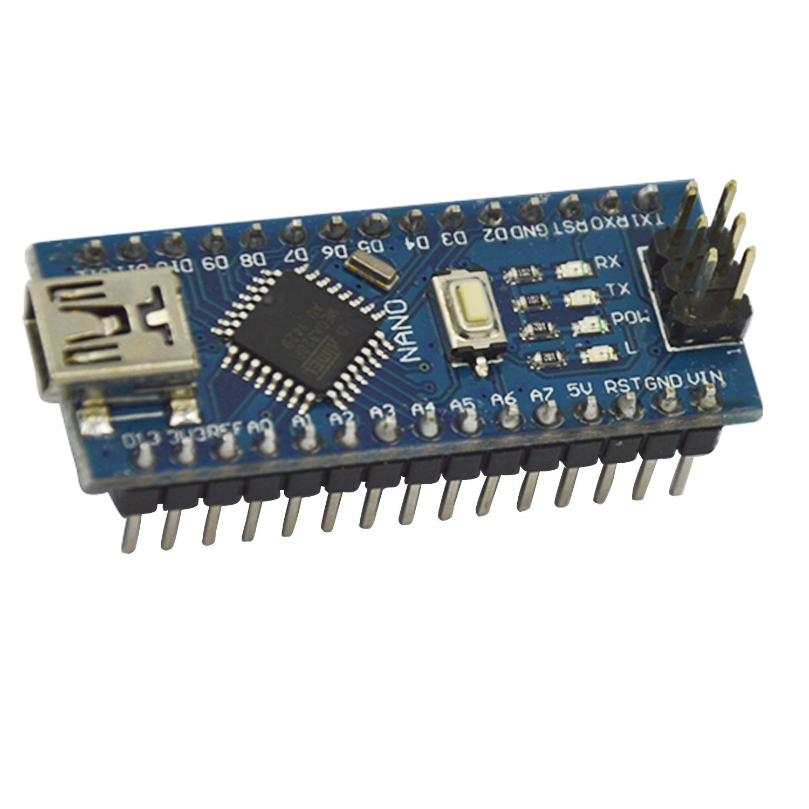

Dentro de este apartado recopilo todo el material que he ido comprando:

## Aliexpress
---

**1. Wireless Module CH340 NodeMCU v3 LUA WiFI Internet of Things development board based on ESP8266**

**2. Node MCU Base ESP8266 Testing DIY Breadboard Basics Tester suitable for NodeMcu V3**

**3. Bluno Nano BLE Buetooth 4.0 controller Compatible with Arduino Nano**

**4. HM-10 Bluetooth BLE 4.0 Module CC2541 Transparent Serial With Logic Level Translator AT-05 AT-09 for Arduino**

## Amazon
---
**1. Mini Nano V3.0 ATmega328P Microcontroller Board w/USB Cable For Arduino**

**Features:** 
* Nano V3.0 ATmega328P Microcontroller Board  w/USB Cable For Arduino
* Fully Compatible to Arduino Nano V3.0 ATmega328P-AU 
ATmega328 Microcontroller
* Bootloader installed, ready to upload sketches from Arduino software
* Microcontroller ATmega328P-AU
* Operating Voltage :5V 
* Input Voltage (recommended) 7V-12V 
* Input Voltage (limits) 6V-20V 
* Digital I/O Pins 14 (of which 6 provide PWM output) 
* Analog Input Pins 8 
* DC Current per I/O Pin 40 mA 
* DC Current for 3.3V Pin 50 mA 
* Flash Memory 32 KB (ATmega328) of which 2 KB used by bootloader
* SRAM 2 KB
* EEPROM 1 KB   
* Clock Speed 16 MHz 
* Dimention: Approx. 45x17x19mm 
* Cable Length:245mm 

**2. Nano I / O Expansion Shield Arduino UNO R1 Nano 3.0+ Nano V3.0 ATmega328P TE276**

  **Features:**
 
**Nano I / O Expansion sensor Shield:** 
* Arduino Nano IO Expansion Shield is specifically designed to facilitate an easy connection between Arduino Nano and many other devices. In essence, it expands the Arduino Nano controller to link those devices in a simple and trouble free manner. It is a perfect companion of Nano breadboard and compatible with both Arduino Nano v2.x and v3.x.

This expansion shield provides:

* 14 x I/O Pin (servo type with GND, power and signal)
* 8 x analog Pin with power output and GND
* 6 x PWM Pin
* 1 x Servo power input
* 5 x I2C expansion Pin
* AREF output
* 3.3V output
 
**USB Nano V3.0 ATmega328P:** 

* CH340G Replace FT232RL
* Operating Voltage（logic level）：5V
* 8 analog inputs ports:A0 ~ A7
* 14 Digital input / output ports:TX,RX,D2 ~ D13
* 6 PWM ports:D3, D5, D6, D9, D10, D11
* 1 pairs of TTL level serial transceiver ports RX / TX
* Using Atmel Atmega328P-AU MCU
* There is bootloader installed in it
* Support USB download and Power
* Support for external 5V ~ 12V DC power supply
* Support power supply by 9V battery

**3. Módulo Bluetooth: JY-MCU HC-06 (4 Pines)**

**4. Bluetooth Módulo de Transceptor HC-05 Maestro Esclavo + Cable TE119 (6 pines)**

## Kickstarter

**1. Unwired One (formely known as Black Swift)**

Enlaces relacionados:
* Kickstarter: https://www.kickstarter.com/projects/1133560316/black-swift-tiny-wireless-computer
* http://www.black-swift.com/
* http://www.black-swift.com/wiki/index.php/Main_Page
* http://www.black-swift.com/forum
* http://www.unwireddevices.com/en/
* http://www.unwireddevices.com/wiki/index.php/Main_Page
* http://www.unwireddevices.com/en/forum/index

**2. RedBear Duo: A small and powerful Wi-Fi + BLE IoT board**

Enlaces relacionados:
* Kickastarter: 
  * https://www.kickstarter.com/projects/1991736672/redbear-duo-a-small-and-powerful-wi-fi-ble-iot-boa
  * https://www.kickstarter.com/projects/1991736672/redbear-duo-a-small-and-powerful-wi-fi-ble-iot-boa/posts/1477351
* http://redbearlab.com/
* GitHub: https://github.com/redbear/Duo

